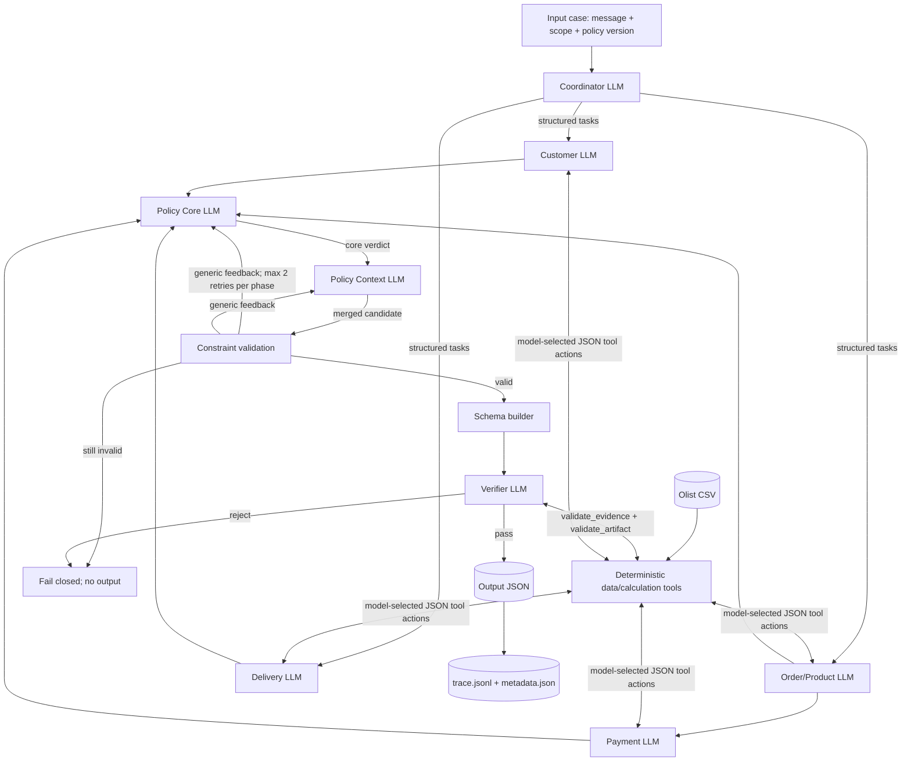

# Kiến trúc hệ thống — Agent-causal EC_POLICY_V2 pipeline

## 1. Nguyên tắc

Pipeline tách ba trách nhiệm:

- **LLM agents** lập kế hoạch, phát hành specialist findings, tổng hợp policy verdict và quyết định verify.
- **Deterministic tools** chỉ đọc CSV, join, cộng tiền, tính variance và kiểm invariant.
- **Runtime** điều phối dependency, chuyển structured handoff và chặn ghi output khi agent/validation thất bại.

Production source không có full deterministic policy solver và không có rules fallback. Nếu model
không tạo được verdict hợp lệ sau retry limit, case thất bại và không được ghi output cũ/mới.

## 2. Workflow



## 3. Agent và quyền truy cập

| Agent | Model? | Input | Tool model tự gọi | Output có ảnh hưởng gì? |
| --- | :---: | --- | --- | --- |
| Coordinator | Có | message, language, scope, policy version | Không | Tạo task objectives và execution waves được runtime sử dụng |
| Customer | Có | task + order reference | `lookup_customer` | `is_repeat_customer` đi vào secondary issue |
| Order/Product | Có | task + order reference | `fetch_order_status`, `fetch_items` | Multi-item/seller/category đi vào Policy |
| Delivery | Có | task + order reference | `fetch_delivery_timestamps`, `compute_variances` | Delivered-late và late-seller đi vào primary issue |
| Payment | Có | task + Order totals | `fetch_payments`, `reconcile` | Split/reconciled đi vào Policy |
| Policy Core | Có | Structured findings của bốn specialists | Không | Chọn primary, party IDs, cause, refund, status và confidence |
| Policy Context | Có | Core verdict + checklist boolean của specialists | Không | Tạo secondary issues và actions; runtime merge với core verdict |
| Verifier | Có | Artifact dự kiến | `validate_evidence`, `validate_artifact` | Pass thì writer ghi; reject thì case fail |

## 4. Tool calling

`src/llm.js::runAgent()` gửi catalog tool trong prompt cùng JSON action protocol đến endpoint
`/chat/completions`. Model phát hành `action=tool` kèm tên tool; runtime chỉ thực thi đúng
tool model yêu cầu, rồi trả `TOOL_RESULT` vào conversation. Sau khi điều tra đủ, model
phát hành `action=final`.

Protocol JSON này giữ hành vi nhất quán giữa các endpoint OpenAI-compatible không đồng
nhất native function calling. Quyết định chọn tool vẫn do LLM phát hành, không phải
runtime gọi sẵn theo case.

`requiredTools` là completeness guardrail: nếu agent kết luận trước khi điều tra đủ, runtime yêu
cầu agent gọi phần còn thiếu. Runtime không tự chạy tools thay model.

## 5. Validation không phải answer solver

Validation được phép kiểm:

- Classification có mâu thuẫn với tool observation không.
- Candidate có thỏa điều kiện của branch đã chọn không.
- Có bỏ qua branch ưu tiên cao hơn không.
- Cause, party, refund và action có nhất quán với branch không.
- Evidence ID có tồn tại không.
- Null/cap/refund-status contracts có hợp lệ không.

Validation chỉ trả constraint violations như “selected branch không thỏa findings”; không tạo một
verdict đúng để thay model và không nói thẳng “đáp án phải là X”.

## 6. Retry và failure

- Coordinator/specialist/mỗi pha Policy/Verifier được retry tối đa 2 lần khi finding vi phạm contract.
- API 429/5xx được retry với backoff ở transport layer.
- Không có `rules_fallback`.
- Không có silent override.
- Case còn lỗi sau retry có `result=null`, writer xóa artifact cũ cùng case và trả process exit code 1.

## 7. A2A và MCP

Pipeline sử dụng **A2A-style structured handoff** trong cùng Node process: Coordinator phát task,
specialist trả finding, Policy Core chuyển core verdict cho Policy Context, và Verifier nhận artifact. Đây chưa phải A2A network
protocol (không Agent Card hoặc remote task endpoint).

Tools hiện dùng model-selected JSON action protocol và local JavaScript implementations; chưa
có MCP server/client. Không mô tả các tool hiện tại là MCP tools.

## 8. Xác minh

```bash
npm test

# smoke test một case bằng provider thật
LLM_PROVIDER=openai node src/run.js EC_001

# full run sau khi smoke test pass
LLM_PROVIDER=openai CONCURRENCY=8 npm run solve

# kiểm artifact sau full run
npm run audit
```

Groundtruth regression không chạy mặc định. Chỉ chạy thủ công khi chủ động đặt
`RUN_GROUNDTRUTH_TEST=1`; production pipeline không import hoặc đọc groundtruth/output cũ.
